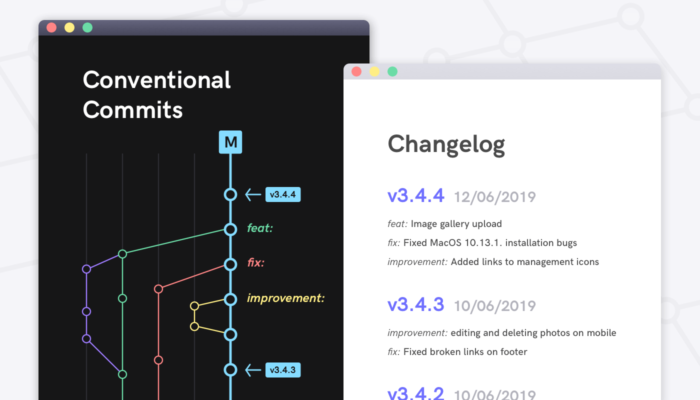
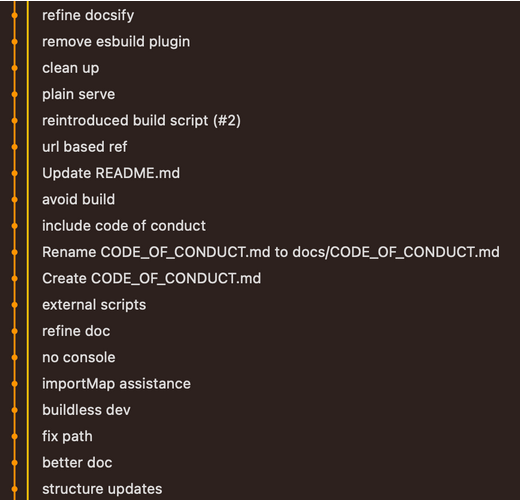
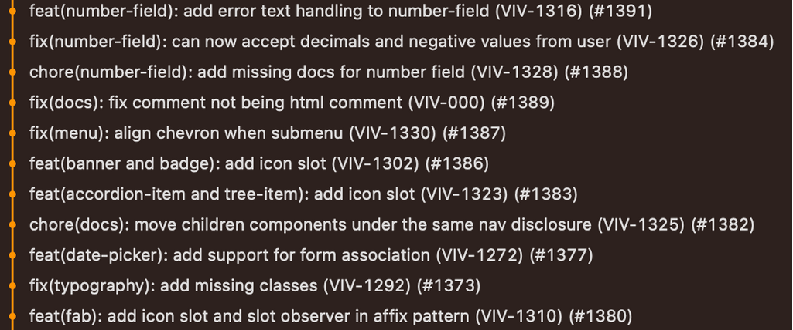

### **Motivos para usar o Conventional Commits**:

1. **Gerar CHANGELOGs automaticamente**: Com base nos tipos de commits realizados, é possível gerar changelogs que acompanham a evolução do projeto e melhoram a transparência.

2. **Determinar automaticamente a versão semântica**: A convenção permite determinar de forma automática um incremento de versão semântica, usando tipos de commits como `feat`, `fix` ou `BREAKING CHANGE`.

3. **Comunicação clara**: Facilita a comunicação entre a equipe de desenvolvimento, usuários e outros stakeholders, explicando a natureza das mudanças.

4. **Integração contínua e publicação**: Pode acionar processos automáticos de build e publicação com base nos commits realizados.

5. **Histórico de commits estruturado**: Ajuda a manter um histórico organizado, facilitando a contribuição de terceiros e melhorando o gerenciamento do código.

#### **Changelogs**
Os changelogs são registros das mudanças realizadas no software, permitindo o acompanhamento da evolução do projeto. Eles são úteis para gerenciar versões e manter a transparência com usuários e colaboradores, atualizados cada vez que uma nova versão é lançada.


---

### **Origem**:
A padronização das mensagens de commit ganhou popularidade com o **AngularJS**, que adotou esse formato para automatizar a criação de changelogs e garantir que as versões fossem liberadas de acordo com as alterações no código. Isso se espalhou pela comunidade de código aberto e é amplamente adotado.

### **Versão Semântica (SemVer)**:
O Conventional Commits se integra ao **SemVer**, permitindo que versões sejam geradas automaticamente com base nos commits:

- **feat**: Adição de uma nova funcionalidade, resultando em incremento de versão menor (1.x.0).
- **fix**: Correção de bug, resultando em incremento de patch (1.0.x).
- **BREAKING CHANGE**: Mudanças que quebram compatibilidade, resultando em incremento de versão principal (x.0.0).


---
### **Estrutura Básica**
```
<tipo>(<escopo>): <descrição>

[Corpo]

[Rodapé]
```
### **Componentes**

- **Tipo**: Indica o tipo de mudança que está sendo feita. Exemplos: feat, fix, docs, style, refactor, perf, test, build, ci, chore, revert.

| Tipo      | Descrição                                       |
|-----------|-------------------------------------------------|
| `feat`    | Nova funcionalidade ou recurso.                 |
| `fix`     | Correção de bugs.                               |
| `docs`    | Alterações na documentação.                     |
| `style`   | Ajustes de formatação sem impacto no código.    |
| `refactor`| Refatoração do código.                          |
| `perf`    | Melhorias de desempenho.                        |
| `test`    | Alterações nos testes.                          |
| `build`   | Mudanças no sistema de build.                   |
| `ci`      | Ajustes na integração contínua.                 |
| `chore`   | Tarefas de manutenção.                          |
| `revert`  | Reversão de commits anteriores.                 |


- **Escopo**: Opcional. Indica a área ou o módulo do código afetado pela mudança. Exemplo: api, auth, ui.

- **Descrição**: Uma breve descrição da mudança realizada, geralmente em minúsculas e no tempo presente. Exemplo: update user authentication method.

- **Corpo**: Uma explicação mais detalhada sobre a mudança, incluindo o motivo da alteração e qualquer outra informação relevante. Deve ser separado da descrição por uma linha em branco.

- **Rodapé** (Opcional): Informações adicionais, como referências a issues, notas sobre mudanças que quebram compatibilidade (BREAKING CHANGE), e outras observações. Deve ser precedido por uma linha em branco.


---

### Exemplo de histórico de commits sem convenção



### Exemplo de histórico de commits com convenção


### **Exemplo de Commit com BREAKING CHANGE**:

Este exemplo usa **simultaneamente** as duas formas de determinar uma funcionalidade que quebra o código: pelo rodapé BREAKING CHANGE e também pelo ! depois do tipo, ou do escopo (caso tenha) do commit:

>⚠️ Lembrando que sembre da descrição para o corpo (body) é necessário ter uma linha em branco.
```
feat(api)!: update user authentication method

BREAKING CHANGE: The authentication method has been updated to use OAuth 2.0 instead of JWT tokens. This change requires all clients to re-authenticate.
```

### **Rodapé em Commits**:
No Conventional Commits, podem ser utilizados **rodapés** para fornecer informações adicionais como fechamento de issues e referências. A prática segue a **convenção git trailer**, que permite usar tokens como `fixes`, `refs`, e outros.

---

### **Considerações**:
- O Conventional Commits incentiva a realização de commits mais estruturados, como correções frequentes.
- A linguagem das mensagens (português ou inglês) de commit pode ser adaptada à equipe, mas deve ser mantida consistente.
- A convenção não é obrigatória para todos os colaboradores, especialmente em workflows baseados em squash, onde as mensagens de commit podem ser ajustadas antes de um merge.

---

### **Referências**:
- [Commit Message Guidelines - Angular](https://github.com/angular/angular/blob/22b96b9/CONTRIBUTING.md#-commit-message-guidelines)
- [SemVer](https://semver.org/)
- [Conventional Commits](https://www.conventionalcommits.org/pt-br/v1.0.0/)
- [Git Trailer](https://git-scm.com/docs/git-interpret-trailers)