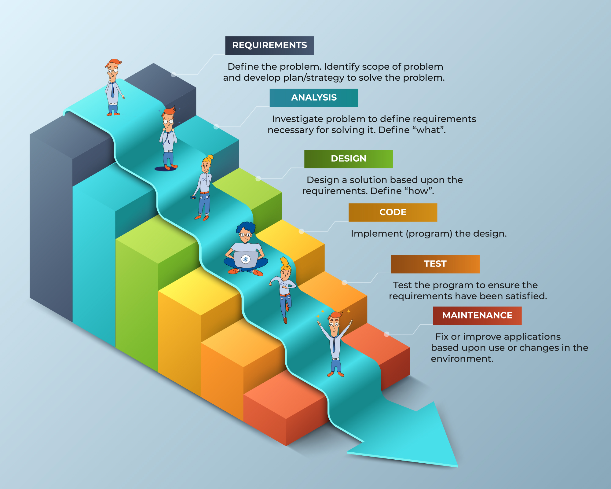
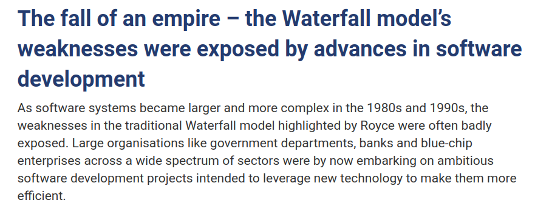
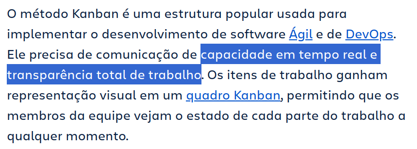
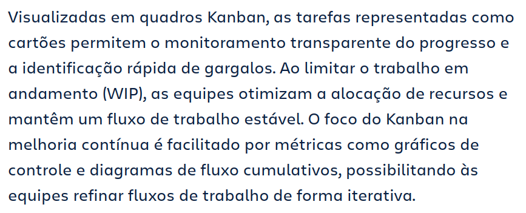
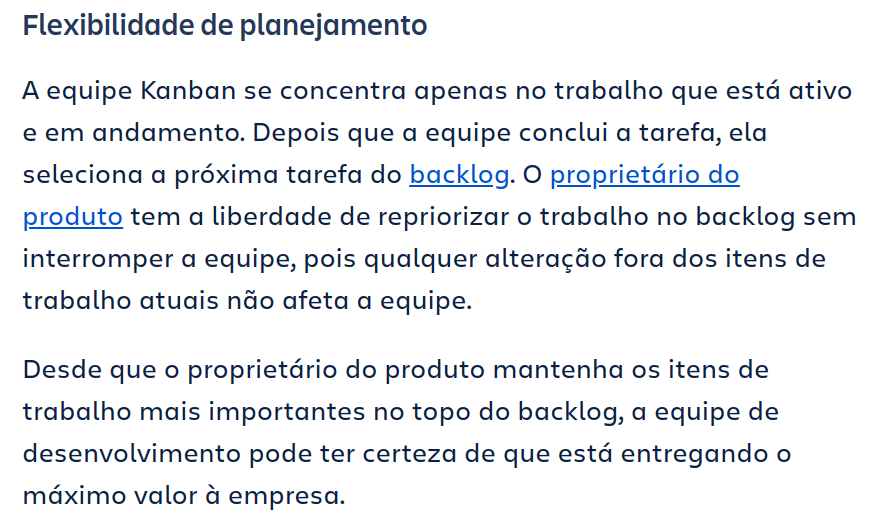
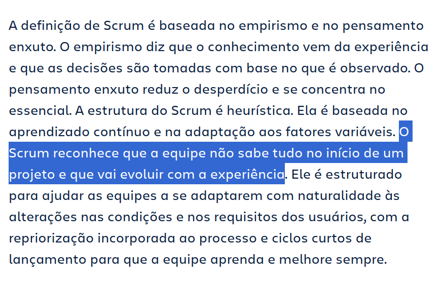
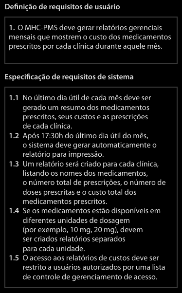
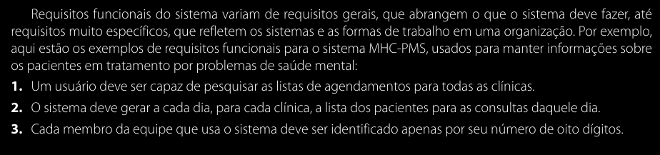
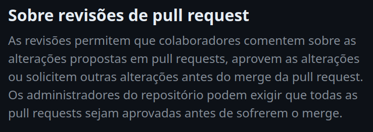

# Guia do Forgiano | Engenharia de Software

🎯 Estudar sobre metodologias de organização (kanban, scrum, ágil, etc), estudar sobre engenharia de software

# Engenharia de Software

A "disciplina de engenharia" que se ocupa com os todos os aspectos do processo de produção de software.

- Abordagem sistemática e organizada
- Técnicas e ferramentas apropriadas
- Se adaptar considerando as limitações de desenvolvimento e os recursos disponíveis

## Processos de Software

Atividades cujo objetivo é a evolução do software

- Especificação
- Desenvolvimento
- Validação
- Evolução

# Metodologias Ágeis

- Modelo Cascata
  

“Incontáveis histórias de projetos de desenvolvimento de software imensamente caros” que viraram problemas muito pra empresas conforme o tempo foi passando. Razões comuns são:

- Levavam tanto tempo pra desenvolver que quando chegava no final do ciclo aquilo ele já estava tecnologicamente ultrapassado
- Tanto tempo pra desenvolver que o mercado mudava antes do lançamento
- Escopo dos projetos grande demais pro gerenciamento de projetos conseguir lidar
- Fazer presunções erradas sobre o projeto e falhar em entender as necessidades do usuário acabava causando um software final que não atendia o propósito nem resolvia o problema
- Bugs e outros problemas descobertos na etapa de validação e testes eram tão grandes e problemáticos que consertá-los não era comercialmente viável.

Com uma abordagem em cascata para o gerenciamento de projetos de desenvolvimento de software, essas suposições e erros errados muitas vezes não são descobertos até o final. Quanto maior e mais caro for o projeto, maior será a exposição ao fracasso.

## Kanban

[O que é kanban? Saiba tudo sobre essa metodologia ágil.](https://www.atlassian.com/br/agile/kanban)

[https://youtu.be/iVaFVa7HYj4](https://youtu.be/iVaFVa7HYj4)

<aside>
🗂️

A posição de “Product Owner”, por exemplo, pode trabalhar pra sempre deixar as tarefas de maior prioridade no topo do backlog, e os outros da equipe não precisam pensar sobre quais tarefas pegar quando tiverem disponíveis.

</aside>

## Scrum

[O que é Scrum? (e como começar) | Atlassian](https://www.atlassian.com/br/agile/scrum)

[Home | Scrum Guides](https://scrumguides.org/)

# Engenharia de Requisitos

[Sommerville]

Os requisitos de um sistema são as descrições do que o sistema deve fazer, os serviços que oferece e as restrições a seu funcionamento. Esses requisitos refletem as necessidades dos clientes para um sistema que serve a uma finalidade determinada, como controlar um dispositivo, colocar um pedido ou encontrar informações. O processo de descobrir, analisar, documentar e verificar esses serviços e restrições é chamado **engenharia de requisitos** (RE, do inglês requirements engineering).

Pensando em níveis de complexidade, podemos pensar na distinção entre requisitos de usuário e requisitos de sistema. Podem ser definidos como segue:

1. **Requisitos de usuário** são declarações, em uma linguagem natural com diagramas, de quais serviços o sistema deverá fornecer a seus usuários e as restrições com as quais este deve operar. **São requisitos abstratos de alto nível**.
2. **Requisitos de sistema** são descrições mais detalhadas das funções, serviços e restrições operacionais do sistema de software. O documento de requisitos do sistema (às vezes, chamado especificação funcional) deve definir exatamente o que deve ser implementado. Pode ser parte do contrato entre o comprador do sistema e os desenvolvedores de software. Expressam a descrição detalhada do que o sistema deve fazer.

Por exemplo:

Os requisitos de software são frequentemente classificados como requisitos funcionais e requisitos não funcionais:

1. **Requisitos funcionais**. São declarações de serviços que o sistema deve fornecer, de como o sistema deve reagir a entradas específicas e de como o sistema deve se comportar em determinadas situações. Em alguns casos, os requisitos funcionais também podem explicitar o que o sistema não deve fazer.
2. **Requisitos não funcionais**. São restrições aos serviços ou funções oferecidos pelo sistema. Incluem restrições de timing, restrições no processo de desenvolvimento e restrições impostas pelas normas. Ao contrário das características individuais ou serviços do sistema, os requisitos não funcionais, muitas vezes, aplicam-se ao sistema como um todo.

Na realidade, a distinção entre diferentes tipos de requisitos não é tão clara como sugerem essas definições simples.

Isso mostra que os requisitos **não são independentes** e que muitas vezes **geram ou restringem outros requisitos**. Portanto, os requisitos de sistema não apenas especificam os serviços ou as características necessárias ao sistema, mas também a **funcionalidade necessária** para garantir que esses serviços/características sejam entregues corretamente.

Exemplo de requisitos funcionais:

Os requisitos não funcionais, como o nome sugere, são requisitos que não estão diretamente relacionados com os serviços específicos oferecidos pelo sistema a seus usuários. Eles podem estar relacionados às **propriedades** emergentes do sistema, como confiabilidade, tempo de resposta e ocupação de área. Uma alternativa a
esse cenário seria os requisitos definirem restrições sobre a implementação do sistema, como as capacidades dos dispositivos de E/S ou as representações de dados usadas nas interfaces com outros sistemas.

# Gerenciamento de Qualidade (Reviews, Testes)

## Git Flow

[Gitflow Workflow | Atlassian Git Tutorial](https://www.atlassian.com/git/tutorials/comparing-workflows/gitflow-workflow)

## Pull Requests

[Merging a pull request - GitHub Docs](https://docs.github.com/en/pull-requests/collaborating-with-pull-requests/incorporating-changes-from-a-pull-request/merging-a-pull-request)

## Code Review

[Sobre revisões de pull request - GitHub Docs](https://docs.github.com/pt/pull-requests/collaborating-with-pull-requests/reviewing-changes-in-pull-requests/about-pull-request-reviews)

# Referências

[Sommerville-Software-Engineering-10ed.pdf](assets/Sommerville-Software-Engineering-10ed.pdf)

[Slides01-Introducao.pdf](assets/Slides01-Introducao.pdf)

[Software Engineering — Software Process and Software Process Models (Part 2)](https://medium.com/omarelgabrys-blog/software-engineering-software-process-and-software-process-models-part-2-4a9d06213fdc)

[What is the Waterfall software development methodology and is it still relevant?](https://kruschecompany.com/waterfall-software-development-methodology/)

[O que é kanban? Saiba tudo sobre essa metodologia ágil.](https://www.atlassian.com/br/agile/kanban)
