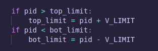

# **Projeto PID com EV3 - Controle e Visualização de Curvas**

Este projeto implementa um controlador **PID** (Proporcional, Integral e Derivativo) em um robô EV3, usando o **MicroPython** com bibliotecas do **Pybricks**, e uma visualização em tempo real dos dados do PID usando **matplotlib**. A comunicação entre o robô e o computador é feita através de **sockets**, que permite enviar dados do servidor (EV3) para o cliente (computador) e visualizar os gráficos de correção PID e ângulo em tempo real.
## **Visão Geral**
O projeto é composto por dois principais scripts:

- `pid_server.py:` O servidor executado no robô EV3, que controla o movimento do robô usando um loop PID para corrigir o ângulo e envia dados desse controle para o cliente via socket.
- `plot_client.py`: O cliente executado no computador, que recebe os dados do servidor e os plota em tempo real usando matplotlib.

## **Client e Server**

- Cliente: O cliente se conecta ao servidor para solicitar dados e atualizar o gráfico em tempo real. No código, o cliente é o script Python que recebe os dados do EV3 para visualização.
- Servidor: O robô EV3 atua como servidor, coletando e enviando dados sobre o controle PID e o ângulo do robô. Ele processa os dados e os disponibiliza para o cliente, que exibe a visualização.

## **Código do Servidor (pid_server.py)**

O primeiro argumento de bind() é o endereço IP ao qual o servidor irá se vincular. Ao passar uma string vazia (""), o servidor é configurado para aceitar conexões em todas as interfaces de rede do dispositivo. Isso significa que ele estará ouvindo em:

- 127.0.0.1 (localhost) — se o cliente estiver na mesma máquina.
- IP da rede local (como 192.168.x.x) — para clientes na mesma rede local.
- Outros IPs atribuídos ao dispositivo — se ele tiver várias interfaces de rede, como uma conexão via cabo e Wi-Fi.

Mas é necessário também haver uma porta, para que o cliente se conecte no servidor correto, por isso o segundo argumento.

Já o método `listen(5)` coloca o socket em modo de escuta, pronto para aceitar conexões. Isso é típico de uma conexão TCP, que é orientada a conexões.

Enquanto isso, a função `send_message` faz com que seja possível o envio de dados e o recebimento para o cliente, no formato de string, que depois é convertida em bytes - método `encode`. Se message for `[10, 20, 30]`, o resultado será a string `"10,20,30"`. Já a variável `recv_message` recebe até 1024 bytes (buffer size) do servidor, e transforma para string.

A função pid faz o mesmo da `pid_teste.py` e retorna as variáveis de `error`, `p_gain`, `d_gain`, `i_gain`, `pid` (soma dos ganhos)

Depois na função `turn`(de girar uma quantidade x de graus), é chamada  a função PID para que dentro da condição de loop, as variáveis de ganho sejam sempre atualizadas de acordo com o erro remanescente. Dentro dessa função também é enviada o log para o servidor por meio de uma lista, e depois printa no terminal.

Na função `main` é inicializado o server e é feita a chamada de função do turn, e após isso ser realizado, o servidor termina.

## **Código do Cliente (plot_client.py)**
### **Conexão Socket**
O cliente se conecta ao servidor EV3 usando o IP e a porta definidos. O EV3 envia dados continuamente, e o cliente recebe esses dados e responde confirmando o recebimento.
O IP do robô está definido como `192.168.137.16`, e a porta é `12345`.

O protocolo padrão da bilbioteca do Python é a TCP. Mas poderia passar de parâmetro outros tipos, tipo a UDP.

Utilizando o Matplotlib, o código cria um gráfico que mostra os dados de PID (controle do motor) e o ângulo do motor. O gráfico é atualizado em tempo real usando a função `FuncAnimation`.
O gráfico mostra o tempo no eixo X e os valores de PID e ângulo no eixo Y (são duas curvas, portanto, em função do **tempo**).

## **Função animate**

O parâmetro `i` em funções como animate no Matplotlib (especialmente quando você usa `FuncAnimation`) é obrigatório porque a função FuncAnimation passa automaticamente um valor para ele. Esse valor é o número do "frame" atual da animação, ou seja, o valor de i representa o índice do quadro a ser atualizado. Isso é visível na chamada da função que ocorre dentro de um parâmetro do matplotlib, já no final do código:

### **Tratamento dos Dados**
Os dados são recebidos como uma string separada por vírgulas e depois convertidos para uma lista de valores numéricos. Esses dados incluem o tempo, os ganhos P, I, D, o valor do PID, o ângulo do motor e o valor alvo.
O cliente recebe os dados, imprime-os no console e adiciona os valores ao gráfico em tempo real.

### **Ajuste Dinâmico do Gráfico**

Os limites superior e inferior do gráfico são ajustados dinamicamente com base nos valores de PID, garantindo que os dados permaneçam visíveis no gráfico. O valor de `V_LIMIT` é inicialmente definido como `200`, e as variáveis `top_limit`, `bot_limit` e `new_offset` são alteradas dentro da função para refletir mudanças nos valores de PID. Essas variáveis mantêm seus valores atualizados mesmo fora do escopo da função, permitindo que o gráfico seja constantemente reescalado conforme o PID varia. O gráfico final é então plotado com base nesses limites, conforme visto no trecho a seguir:

### **Encerramento da Conexão**
Quando o servidor envia a mensagem de fim, o cliente responde e encerra a conexão.

### **Fluxo de Dados**

- Conexão: O cliente se conecta ao servidor do EV3.
- Recepção: O cliente recebe os dados PID e os valores de ângulo enviados pelo robô.
- Visualização: Os valores recebidos são exibidos em tempo real em um gráfico.
- Confirmação: Após receber os dados, o cliente envia uma confirmação para o servidor.
- Encerramento: Quando o processo termina, o cliente encerra a conexão.