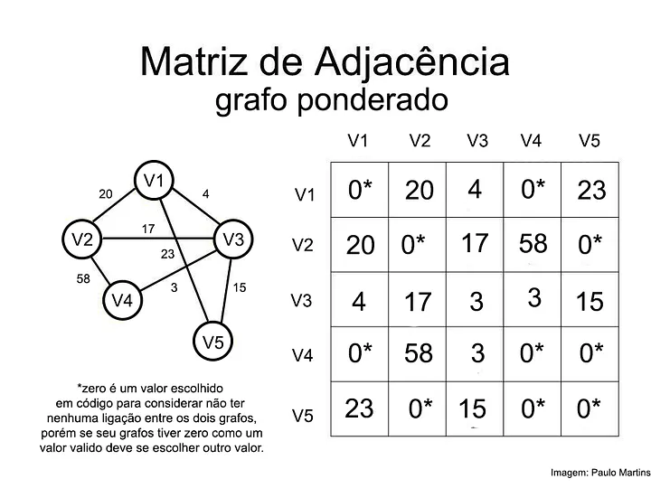
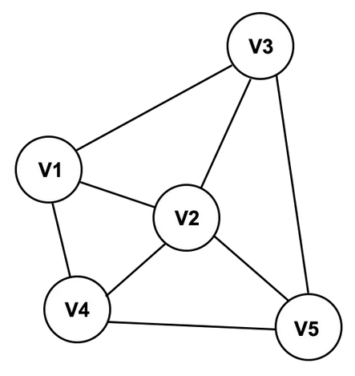
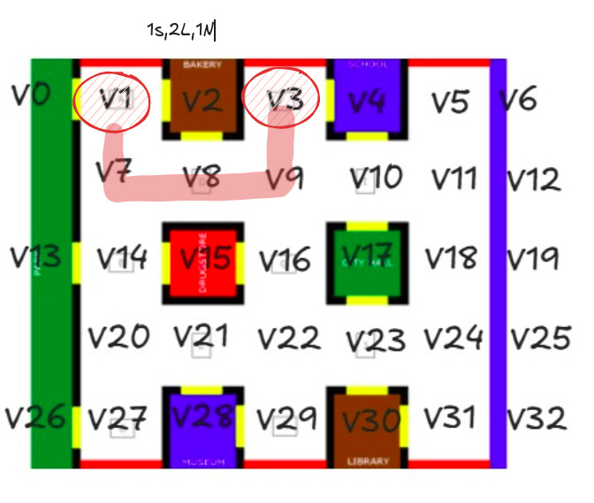

# Teoria Básica de Grafos

### O que é uma matriz de adjacência?

Uma matriz de adjacência é uma das formas de se representar um **grafo**. Ela sempre será **quadrada** e o seu índice será a quantidade de vértices de um grafo. Mais tarde falaremos o que é um grafo. A variação de uma matriz de adjacência está no fato de ser **ponderada** ou não. Uma matriz não ponderada, como essa da figura, retrata apenas se há ou não conexão (1) para presença de conexão e (0) pela ausência. Sempre podemos representar um grafo **direcional** na matriz de adjacência pois é possível diferenciar matematicamente M[i,j] de M[j,i] (aresta que sai do vértice i para o vértice j, e vértice que sai do j para o i, respectivamente). Abaixo está um exemplo de uma matriz não ponderada.

Aqui está outro exemplo de matriz de adjacência mas com um grafo ponderado:

### O que é uma lista de adjacência?

Ela é uma estrutura que armazena todos os vértices que são conexão de um determinado vértice, por exemplo, a figura abaixo possui o V2. Uma lista de adjacência para o V2 seria = [V1, V3, V4, V5].

### O que é um grafo?

Os grafos podem ser usados para representar diversas situações do mundo real, como redes de computadores, sistemas de transporte, relacionamentos sociais e muito mais. Nesse caso iremos usar para representar um tabuleiro que possui vértices e distâncias entre os vértices que pode ser representado como o peso da aresta.

### Quando usar cada representação?

Está listado abaixo alguns pontos para serem levados em consideração:

- **Grafos densos**: Possuem muitas arestas em relação ao número de nós. Nesse caso, a lista de adjacências se torna inviável devido ao seu tamanho. Utilize matrizes de adjacência.

- **Grafos esparsos**: Têm muitos nós e poucas arestas. A escolha entre lista ou matriz depende das operações a serem realizadas.

- **Buscas**: São mais rápidas em listas de adjacência, pois mostram diretamente as conexões de um nó. Em uma matriz, seria necessário percorrer toda a linha.

- **Teste de existência de aresta**: É mais eficiente com matrizes, verificando diretamente a célula (i,j).

- **Encontrar nós predecessores**: Mais rápido com matrizes, já que é possível verificar diretamente as conexões. Com listas, seria necessário percorrer toda a lista.

# Sobre o código

Este projeto implementa um grafo direcionado com o algoritmo de Dijkstra para encontrar o menor caminho entre dois vértices, utilizando pesos unitários e direções cardinais (Norte, Sul, Leste, Oeste). Além disso, o código oferece uma forma compacta de representar as direções tomadas no caminho mais curto, criando um "mapa do tesouro", que compacta sequências de direções iguais para facilitar a leitura. Isso é uma formatação de saída interessante para ser passada à parte de movimentação do robô.

### O que é o algoritmo de Dijkstra?
Ele é um algoritmo que calcula uma distância mínima de um ponto a outro, com pesos não negativos em suas arestas. Pode ser dividido em algumas etapas:

- **Inicialização**: Comece atribuindo um valor de distância infinito a todos os vértices, exceto o vértice de origem, que recebe uma distância de 0. Crie um conjunto de vértices não visitados.

- **Seleção do Vértice**: Selecione o vértice não visitado com a menor distância (inicialmente, o vértice de origem).

- **Atualização das Distâncias**: Para o vértice selecionado, considere todos os seus vizinhos. Para cada vizinho, calcule a distância total a partir do vértice de origem. Se essa distância for menor do que a distância atualmente registrada, atualize a distância.

- **Marcação como Visitado**: Após considerar todos os vizinhos, marque o vértice como visitado, o que significa que sua menor distância foi encontrada.

- **Repetiçã**o: Repita os passos 2 a 4 até que todos os vértices tenham sido visitados ou que a menor distância entre os vértices não visitados seja infinita.

### Exemplo de menor caminho

Os testes são feitos de maneira que independente do meio adotado para calcular o algoritmo, algumas coisas devam funcionar, por exemplo a **saída padrão** desse caso, que busca o menor caminho entre o vértice 1 e o 3. Vale ressaltar que o caminho que passa pelo vértice 2 **não é válido**, apesar dele ser o menor em termo de distância. Mas devemos respeitar a presença ou não de caminho, que é ditado pelo vértice direcional que criamos na lista de listas de adjacências. Podemos observar isso na figura abaixo, em que o caminho correto é **1S, 2L, 1N**. (OBS:. Esse caso é o input padrão do `dijkstra.py`)

### Outras ferramentas

#### ⛓️heapq

Fornece uma implementação de uma fila de prioridade baseada em uma estrutura de dados conhecida como *heap*, isto é, permite a inserção e remoção de elementos de forma eficiente, mantendo sempre o menor (ou maior) elemento no **topo** da estrutura. A inserção e remoção de elementos no heap têm complexidade de tempo O(log⁡n), tornando-o eficiente para operações de **fila de prioridade**.

Uma coisa legal, é que por padrão, heapq cria um heap mínimo, onde o menor elemento é o 1º a ser removido, ideal para o algoritmo de Dijkstra. Outras funções que a biblioteca possui, são:

`heapq.heappush(heap, item):` Adiciona um item ao heap.

`heapq.heappop(heap)`: Remove e retorna o menor item do heap.

`heapq.heapify(x)`: Transforma a lista x em um heap em tempo linear.

`heapq.nlargest(n, iterable)`: Retorna os n maiores elementos do iterable.

`heapq.nsmallest(n, iterable)`: Retorna os n menores elementos do iterable.

#### 🐍pytest

É uma estrutura de testes para Python que facilita a criação e execução de testes automatizados. Uma de suas funções é que ele descobre automaticamente arquivos e funções de teste que seguem convenções de nomenclatura, como nomes que começam ou terminam com "test". Existem aspectos mais avançados que eu recomendo que assistam a [Live de Python](https://www.youtube.com/watch?v=MjQCvJmc31A), por exemplo, como parametrizar os testes, o que são fixtures, etc.

### Referências

- [Explicação teórica sobre grafos](https://medium.com/@paulomartins_10299/grafos-representa%C3%A7%C3%A3o-e-implementa%C3%A7%C3%A3o-f260dd98823d)

- [Documentação oficial do Pytest](https://docs.pytest.org/en/stable/)

- [Live de Python 167]((https://www.youtube.com/watch?v=MjQCvJmc31A))