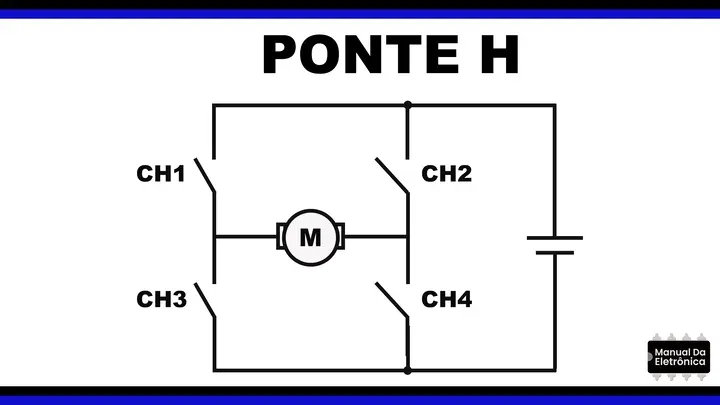

# Ponte H – Modelo DRV8833

Antes de entender o funcionamento do componente DRV8833, é importante conhecer alguns conceitos básicos:

## O que é um motor de corrente contínua?

Um motor de corrente contínua (DC) é um dispositivo que converte energia elétrica em movimento rotativo. Ele funciona quando uma corrente elétrica passa por sua bobina, gerando um campo magnético que interage com um campo fixo e faz o eixo girar. O sentido da rotação depende da direção da corrente.

## O que é uma Ponte H?

A ponte H é um circuito eletrônico que controla a direção de rotação de um motor DC, invertendo a polaridade nos terminais do motor. Esse nome vem do formato do circuito, que lembra a letra "H" com o motor no meio e quatro "chaves" (CH1, CH2, CH3, CH4) nos cantos.

### Como funciona:
- Se CH1 e CH4 forem fechadas (ligadas), a corrente passa de um lado ao outro, e o motor gira em um sentido (por exemplo, horário).
- Se CH2 e CH3 forem fechadas, a corrente passa no sentido contrário, e o motor gira no sentido oposto (anti-horário).
- Se CH1 e CH2 ou CH3 e CH4 forem fechadas ao mesmo tempo, a corrente não circula corretamente e o motor não gira.
- Se todas as chaves forem ligadas ao mesmo tempo, ocorre um curto-circuito, o que pode danificar o circuito.

## O que é um sinal de PWM?

PWM significa Modulação por Largura de Pulso (Pulse Width Modulation). É uma técnica usada para controlar a potência fornecida a um dispositivo, sem alterar a tensão da fonte.

### Como funciona:
Imagine uma chave que liga e desliga muito rapidamente:
- Quando a chave está ligada, a carga recebe a tensão máxima.
- Quando está desligada, a carga não recebe tensão.
- Ao alternar entre ligar e desligar em tempos diferentes, conseguimos controlar a “média” da energia enviada.

O tempo em que a chave fica ligada é chamado de largura do pulso. Quanto maior essa largura, maior a energia transmitida ao motor. Com isso, conseguimos controlar a velocidade do motor sem precisar usar resistores ou desperdício de energia.

## Ponte H, modelo DRV8833

O DRV8833 é um driver que possui duas pontes H para controle de corrente de motores. Isso significa que é possível controlar dois motores DC individualmente ou um motor de passo. Cada uma dessas pontes possui circuitos para a regulação ou limitação de corrente. Além disso, também há pinos de controle para detecção de falhas (como superaquecimento ou problemas na corrente) e para modo de economia de energia (modo sleep).

O modelo possui uma interface PWM simples, que permite conexão direta com o circuito controlador. Isso quer dizer que ele aceita sinais PWM nas suas entradas, facilitando o controle da velocidade do motor por meio de sinais digitais comuns. Também possui um sistema interno de desaceleração lenta que evita picos perigosos relacionados a mudanças rápidas na corrente elétrica.

É possível ligar as duas pontes H em paralelo para dobrar a capacidade de corrente de um único motor. Isso é útil em motores que exigem mais força.

No esquema abaixo, o DRV8833 recebe sinais de controle (PWM, nSLEEP e nFAULT) de um microcontrolador. A alimentação vai de 2,7 V até 10,8 V, e o chip pode fornecer até 1,5 A por canal para os terminais do motor.

## Características do modelo

Além da presença de duas pontes H, o chip também possui como característica:

### Controle da Ponte H
O DRV8833 possui entradas chamadas AIN1, AIN2, BIN1 e BIN2. Essas entradas controlam as saídas AOUT1, AOUT2, BOUT1 e BOUT2, que se conectam aos motores. Os sinais nos pinos AIN/BIN determinam o estado da ponte H: se ela aplica tensão ao motor, inverte o sentido ou coloca o motor em repouso.

### Modos de decaimento

As entradas também podem ser usadas para controle de velocidade do motor com PWM. Quando há a interrupção da corrente, a natureza indutiva do motor exige que a corrente continue fluindo, o que é chamado de corrente de circulação. O chip tem dois modos diferentes para lidar com isso:

- Fast decay: o chip desativa a ponte H. Com isso, a corrente circula pelos diodos internos dos transistores. Essa configuração faz a corrente cair mais rapidamente.
- Slow decay: o chip liga os dois lados da ponte H em nível baixo, criando um curto interno entre os terminais do motor. A corrente circula nesse caminho e diminui mais devagar.

### Controle de corrente

O DRV8833 tem um recurso interno que controla a corrente que passa no motor de modo a prevenir a sobrecarga. Caso isso aconteça, o sistema desliga a ponte H temporariamente (em modo slow decay), e a reativa no início do próximo ciclo PWM. Tal mecanismo evita danos ao chip e ao motor.

### Modo nSleep

O pino nSLEEP é usado para colocar o chip em modo de economia de energia. Com esse pino em nível baixo (0), o dispositivo entra em modo sleep, desligando as pontes H, a bomba de carga, a lógica interna e todos os sinais de controle. Isso reduz significativamente o consumo quando os motores não estão em uso. Ao retornar nSLEEP para nível alto (1), o chip leva até 1 milissegundo para voltar a funcionar.

### Proteção de sobrecarga

O DRV8833 possui proteções contra três tipos de falhas:
- Proteção contra sobrecorrente: o chip monitora a corrente nos transistores. Se ultrapassar o limite por tempo suficiente, a ponte H é desligada e o pino nFAULT é ativado (nível baixo). Após um intervalo, o chip tenta religar automaticamente.
- Proteção contra superaquecimento: se a temperatura interna ultrapassar o limite seguro, todas as pontes H são desligadas e o pino nFAULT é ativado. O chip volta a funcionar assim que esfria.
- Proteção contra subtensão: se a tensão no pino VM cair abaixo do limite mínimo, o chip desliga os circuitos internos e reinicia a lógica. O pino nFAULT também é ativado. Quando a tensão se estabiliza, o chip retoma seu funcionamento.

## Como definir a tensão e corrente do motor?

A tensão usada para alimentar o motor depende de dois fatores principais:
- A tensão recomendada pelo fabricante do motor.
- A velocidade (RPM) desejada.

Quanto maior a tensão, maior a velocidade do motor. A tensão máxima suportada pelo DRV8833 é de 10.8 V.

## Conclusão

Este material é um resumo com foco introdutório, pensado para facilitar o entendimento do funcionamento do DRV8833 de forma simples e direta. Para aplicações mais avançadas ou dúvidas específicas, é recomendável consultar diretamente o datasheet oficial do componente, onde estão disponíveis todos os detalhes técnicos.

## Referências:

- [Vídeo sobre ponte H](https://www.youtube.com/watch?v=wHr3JmXi_Ts)
- [Vídeo sobre o modelo DRV8833](https://www.youtube.com/watch?v=YBRwnw2pDsY)
- [Motor de corrente contínua - guia básico](https://blog.kalatec.com.br/motor-corrente-continua/)
- [Motor DC: características e aplicações](https://www.mundodaeletrica.com.br/motor-de-corrente-continua-caracteristicas-e-aplicacoes/#google_vignette)
- [O que é PWM – Manual da Eletrônica](https://www.manualdaeletronica.com.br/o-que-e-pwm-funcionamento-e-aplicacoes/)
- [Ponte H – Manual da Eletrônica](https://www.manualdaeletronica.com.br/ponte-h-o-que-e-como-funciona/)
- [Datasheet DRV8833 – AllDatasheet](https://www.alldatasheet.com/html-pdf/835834/TI1/DRV8833/54/1/DRV8833.html)