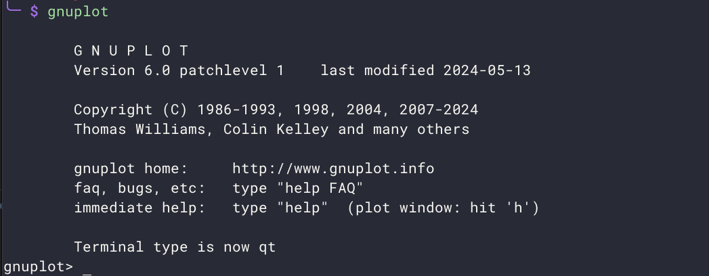
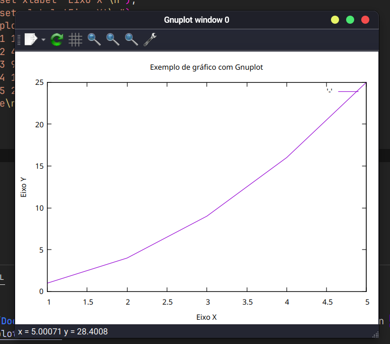

## Primeiros passos
### Instalação - Linux
Existem diversas maneiras de realizar a instalação, basta adaptar para o seu gerenciador de pacotes. Nesse caso estarei utlizando o pacman.
O primeiro comando será `sudo pacman -S gnuplot`. Para verificar a instalação, utilize o comando `gnuplot --version`. Outra maneira de instalar as dependências é através de `pip install -r requirements.txt`. Para isso é recomendado também que tenha sido criado um ambiente virtual para não acontecer nenhum conflito ao instalar as dependências, visto que você estará trabalhando em um projeto novo.

Os binários do gnuplot serão automaticamente colocados em um diretório incluído no seu PATH, como /usr/bin/gnuplot. Você pode acessar e executar o gnuplot diretamente a partir do terminal digitando gnuplot.
<div align="center">
    
</div>
⚠️
Se você precisar de uma versão mais recente ou específica do gnuplot que não esteja disponível nos repositórios do seu sistema operacional, você pode compilar o gnuplot a partir do código-fonte. Para isso siga os próximos passos:

- Baixe o código-fonte do gnuplot a partir do [site oficial](http://www.gnuplot.info/).

- Compile e instale com os seguintes comandos:
```
./configure 
make
sudo make install
```

### Para compilar o arquivo 

Utilize o comando para gerar um executável (plot_example) a partir de um código fonte(plot_example.c): `gcc -o plot_example plot_example.c`
Agora para executar o programa compilado é só usar: `./plot_example`
Lembre-se de que o compilador para C++ é o g++ e não o gcc. Por isso, algumas sintaxes específicas do C++ não serão reconhecidas caso você utilize o gcc (que é o compilador específico para C).

### Instalação - Windows

Para instalar o Gnuplot no Windows, é preciso seguir alguns passos. Acesse o site oficial do gnuplot e clique na seção de downloads e baixe a versão mais recente do instalador para Windows. Execute o instalador baixado e siga as instruções na tela. Durante a instalação, certifique-se de marcar a opção para adicionar o gnuplot ao seu PATH do sistema, facilitando o acesso via linha de comando.

Abra o prompt de comando (cmd) e digite gnuplot. Se o gnuplot estiver corretamente instalado, uma janela interativa do gnuplot será aberta. Você pode usar o gnuplot diretamente através do prompt de comando, ou pode criar scripts .plt e executá-los diretamente no gnuplot.

---

## Exemplo de código

Código simples para ilustrar a ideia desse programa que ajuda a plotar gráficos. A implementação estará no código da pasta `src`.

```c
#include <stdio.h>
#include <stdlib.h>

int main() {
    FILE *gp = popen("gnuplot -persistent", "w");
    if (gp == NULL) {
        fprintf(stderr, "Erro ao abrir o Gnuplot.\n");
        return 1;
    }

    fprintf(gp, "set title 'Exemplo de gráfico com Gnuplot'\n");
    fprintf(gp, "set xlabel 'Eixo X'\n");
    fprintf(gp, "set ylabel 'Eixo Y'\n");
    fprintf(gp, "plot '-' with lines\n");
    fprintf(gp, "1 1\n");
    fprintf(gp, "2 4\n");
    fprintf(gp, "3 9\n");
    fprintf(gp, "4 16\n");
    fprintf(gp, "5 25\n");
    fprintf(gp, "e\n");

    pclose(gp);

    return 0;
}
```

### Resultado



---


## Materiais de leitura [PT-BR]

- [Introdução ao uso do gnuplot](https://www2.fct.unesp.br/docentes/carto/galo/web/gnuplot/pdf/2017_Galo_Gnuplot_Tutorial.pdf);