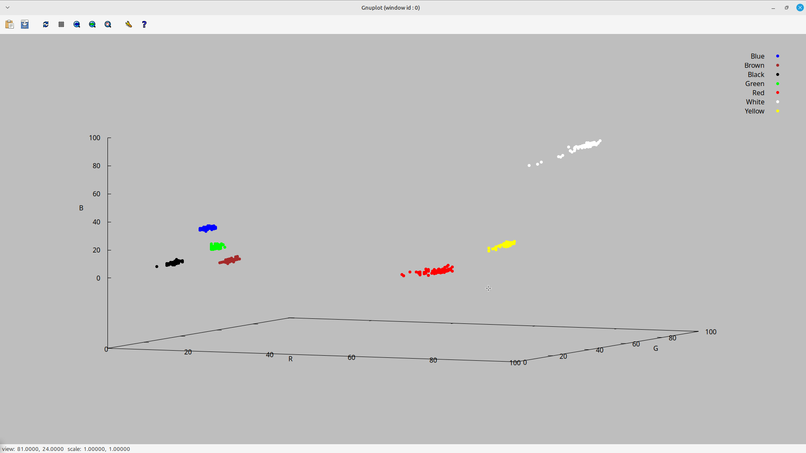

## Ferramenta - Gnuplot
### O que o gnuplot é capaz de fazer?
O Gnuplot lida tanto com curvas (2 dimensões) quanto com superfícies (3 dimensões). Para gráficos em 2D, existem vários estilos de plotagem, incluindo linhas, pontos, caixas, mapas de calor, histogramas empilhados e projeções contornadas de dados 3D. Os gráficos podem ser rotulados com rótulos e setas arbitrárias, rótulos dos eixos, um título, data e hora, e uma legenda. A interface inclui edição de linha de comando e histórico na maioria das plataformas.
## Primeiros passos
### Instalação - Linux
Existem diversas maneiras de realizar a instalação, basta adaptar para o seu gerenciador de pacotes. Nesse caso estarei utlizando o pacman.
O primeiro comando será `sudo pacman -S gnuplot`. Para verificar a instalação, utilize o comando `gnuplot --version`.É recomendado também que tenha sido criado um ambiente virtual para não acontecer nenhum conflito ao instalar as dependências, visto que você estará trabalhando em um projeto novo.

Os binários do gnuplot serão automaticamente colocados em um diretório incluído no seu PATH, como /usr/bin/gnuplot. Você pode acessar e executar o gnuplot diretamente a partir do terminal digitando gnuplot.
<div align="center">
    
</div>
⚠️
Se você precisar de uma versão mais recente ou específica do gnuplot que não esteja disponível nos repositórios do seu sistema operacional, você pode compilar o gnuplot a partir do código-fonte. Para isso siga os próximos passos:

- Baixe o código-fonte do gnuplot a partir do [site oficial](http://www.gnuplot.info/).

- Compile e instale com os seguintes comandos:
```
./configure 
make
sudo make install
```
- Para entender mais da instalação acesse a [documentação oficial de instalação](https://sourceforge.net/p/gnuplot/gnuplot-main/ci/master/tree/INSTALL.gnu).

### Instalação - Windows

Para instalar o Gnuplot no Windows, é preciso seguir alguns passos. Acesse o site oficial do gnuplot e clique na seção de downloads e baixe a versão mais recente do instalador para Windows. Execute o instalador baixado e siga as instruções na tela. Durante a instalação, certifique-se de marcar a opção para adicionar o gnuplot ao seu PATH do sistema, facilitando o acesso via linha de comando.

Abra o prompt de comando (cmd) e digite gnuplot. Se o gnuplot estiver corretamente instalado, uma janela interativa do gnuplot será aberta. Você pode usar o gnuplot diretamente através do prompt de comando, ou pode criar scripts .plt e executá-los diretamente no gnuplot.

## Plotagem dos Dados Gerados pela Leitura dos Sensores de Cor

Foi criado um script para gerar uma representação em 3 dimensões dos dados coletados dos sensores de cor. Cada eixo da representação corresponde a um valor de cor: vermelho (red), verde (green) ou azul (blue).

### Bibliotecas Utilizadas

    <iostream>: Para operações de entrada e saída padrão.
    <fstream>: Para manipulação de arquivos.
    <vector>: Para usar o tipo de dados std::vector, que é uma sequência dinâmica de elementos.
    <string>: Para usar o tipo de dados std::string.
    <sstream>: Para manipulação de strings como fluxos de entrada e saída.

### Função de Manipulação dos Dados

A função criada recebe um arquivo .csv (localizado no mesmo diretório) que contém os dados das 7 cores definidas: azul, marrom, preto, verde, vermelho, branco e amarelo.

A primeira linha do arquivo é ignorada, pois normalmente contém os cabeçalhos das colunas. Em seguida, cada linha é lida e armazenada em uma string chamada line. A classe std::stringstream é utilizada junto com std::getline para dividir a string da linha em partes, de forma similar ao método .split() em Python.

Cada valor extraído é convertido para double e adicionado aos vetores correspondentes (xs, ys, zs), que representam as três dimensões dos dados.

### Função Principal

Na função main, é declarado um vetor para armazenar os nomes dos arquivos .csv e outro para os nomes das cores. Esses vetores são utilizados para gerar arquivos .dat individuais para cada cor, que são utilizados pelo Gnuplot.

Um laço percorre cada nome de arquivo e cria um arquivo .dat correspondente. Vale ressaltar que os vetores xs, ys e zs são sobrescritos a cada iteração para representar o correspondente em uma cor diferente. Finalmente, os dados são gravados nos arquivos .dat no formato adequado.

### Comando no Gnuplot
Para abrir o Gnuplot, digite `gnuplot` no terminal. Isso iniciará o Gnuplot, que será aberto no terminal, pronto para receber comandos. Em seguida, digite load `plot_data.plt` para carregar e executar o script responsável por plotar os dados. Isso deve funcionar tanto para Linux, Mac e Windows.

## Overview

O resultado final deve se parecer com isso (o fundo pode ter outra cor além da cinza, mas optou-se por ela para não se misturar com os pontos brancos plotados):
<div align="center">
    
</div>

## Materiais de leitura [PT-BR]

- [Introdução ao uso do gnuplot](https://www2.fct.unesp.br/docentes/carto/galo/web/gnuplot/pdf/2017_Galo_Gnuplot_Tutorial.pdf);
