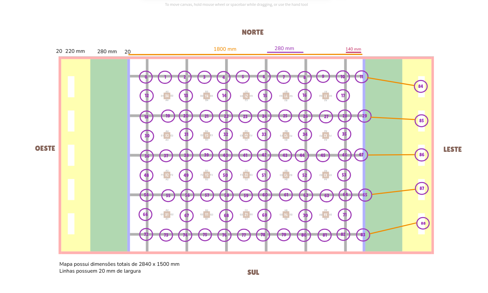
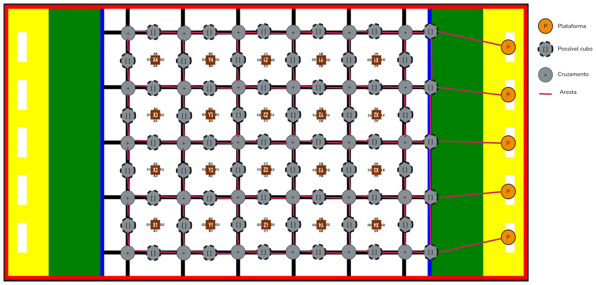

# Representação do Mapa

O mapa do desafio será interpretado internamente pelo robô como um grafo. Cada nó desse grafo corresponderá a uma posição discretizada do mapa, incluindo cruzamentos, possíveis posições de cubos e locais de coleta (plataformas). As arestas representarão os caminhos possíveis entre essas posições, respeitando a estrutura linear e os cruzamentos da pista.


*Figura 1: Grafo construído sobre arena do desafio*

 
*Figura 2: Representação do mapa como grafo com nós tipificados*

## Estrutura do Grafo

A estrutura básica do grafo foi definida previamente com base na topologia fixa da arena, que já é conhecida pela equipe. O grafo possui **89 nós** organizados da seguinte forma:

### Tipos de Nós

- **Nós de Cruzamento** (círculos cinza com "+"): Pontos genéricos de passagem e navegação
- **Nós de Coleta** (círculos com engrenagem): Possíveis posições de cubos a serem coletados  
- **Nós de Plataforma** (círculos laranja com "P"): Destinos para entrega de cubos coletados
- **Nós de Obstáculo**: Regiões inacessíveis (cubos brancos ou áreas restritas)

### Atributos Dinâmicos

Os atributos internos dos nós são inicializados como indefinidos e atualizados dinamicamente durante a exploração:

**Para nós de plataforma:**
- Cor da plataforma (fundamental para mapeamento correto dos destinos)
- Contador de cubos entregues (controle do limite de 3 cubos por plataforma)

**Para nós de coleta:**
- Cor do cubo identificado
- Status atual: `UNKNOWN`, `DETECTED`, `COLLECTED`, `ABSENT`

**Para todos os nós:**
- Timestamp da última visita (priorização de áreas pouco exploradas)

## Implementação

### Estrutura de Classes

```python
class NodeType(Enum):
    INTERSECTION = 1      # Cruzamentos
    PLATFORM = 2         # Plataformas de entrega  
    CUBE_COLLECTION = 3  # Pontos de coleta
    OBSTACLE = 4         # Áreas inacessíveis

class CubeStatus(Enum):
    UNKNOWN = 0    # Status inicial
    DETECTED = 1   # Cubo identificado
    COLLECTED = 2  # Cubo coletado
    ABSENT = 3     # Confirmado sem cubo
```

### Navegação e Pathfinding

O sistema utiliza o algoritmo de Dijkstra para calcular rotas otimizadas, considerando:
- Obstáculos fixos (nós brancos)  
- Pesos das arestas baseados na dificuldade de navegação

## Testes

O sistema inclui testes abrangentes para validar:
- Estrutura correta do grafo (89 nós, conexões adequadas)
- Funcionalidade do algoritmo de pathfinding
- Comportamento com obstáculos
- Sistema de tipificação de nós

Para executar os testes:
```bash
pytest tests/test_map.py
```

## Observações e próximos passos

- Verificação da estrutura (se será necessário adicionar mais vértices ou arestas)
- Calibração dos pesos das arestas
- Talvez já testar com algortimos de busca cega.