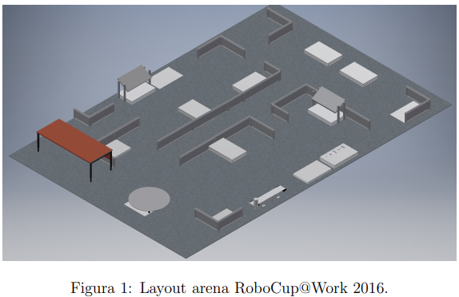

# Primeiro Contato | RoboCup @Work

# Conceitos/Tecnologias

- Visão Computacional
- Adaptação a condições ambientais
- Manipulação de objetos
- Navegação otimizada
- Inteligência Artificial
- Padronização e integração de sistemas
- Otimização de rotas

# Aspectos do Robô

- Rodas para movimento em superfícies firmes e planas
- Manipulador capaz de manipular objetos específicos
- Sensores para adquirir informações ambientais e de objetos
- “Nível de qualidade profissional”
- Sem limitação de tamanho, desde que o robô caiba na arena
    - A menor passagem é de 80cm de largura, o robô deve ser capaz de manobrar nesse espaço
- Baterias não podem exceder 500Wh, voltagem máxima de 60V
- O robô não pode exceder a velocidade máxima de 1.5 m/s
- Atuadores devem ser elétricos, pneumáticos ou hidráulicos. Motores a combustão ou explosivos são estritamente proibidos
- Robôs não devem poluir ou danificar o ambiente a sua volta de nenhuma forma

# Aspectos da Arena

- Ambiente 2D estático, composto por paredes, mesas, obstáculos, etc
- 10m² a 120m² de área
- Disposições podem incluir salas e corredores
- Áreas onde os robôs tem que exercer tarefas são marcadas como “Áreas de Serviço”
- Cada Área de Serviço deve ser acessível por pelo menos um caminho que tenha no mínimo 80cm de largura
- Múltiplos caminhos entre áreas de serviço
- Área de START e de END

- Chão de material firme, com irregularidades de até 1cm em qualquer direção. Nada de líquidos ou materiais como areia, cascalho, carpete.
- A arena tem duas partes: uma com um carpete e marcas para auxiliar a navegação, e outra sem.
    - As duas partes terão os mesmos elementos, dispostos de formas diferentes
    - Tarefas realizadas na área sem marcações terão 20% de bonus

# Links

[https://drive.google.com/file/d/1wgBduYhNcTf2cric37kPpeIGBm1LsgUx/view?usp=drive_link](https://drive.google.com/file/d/1wgBduYhNcTf2cric37kPpeIGBm1LsgUx/view?usp=drive_link)

[Welcome to RoboCup@Work!](https://atwork.robocup.org/)

[TDP Search Engine](https://tdpsearch.com/)

[robocup-at-work](https://github.com/robocup-at-work)

[apriltag_ros - ROS Wiki](https://wiki.ros.org/apriltag_ros)

Drive do Otávio de materiais sobre a RoboCup@Work (TDPs, regras, vídeos):

[https://ufubr-my.sharepoint.com/:f:/r/personal/otavio_leite_ufu_br/Documents/UFU/TCC/Materiais/Robocup%20@Work?csf=1&web=1&e=HYZiIS](https://ufubr-my.sharepoint.com/:f:/r/personal/otavio_leite_ufu_br/Documents/UFU/TCC/Materiais/Robocup%20@Work?csf=1&web=1&e=HYZiIS)

## Sites Equipes 2024

- SWOT
    
    [RoboCup@Work :: University of Applied Sciences Würzburg-Schweinfurt](https://robotik.thws.de/en/research/projects/robocupwork/)
    
- b-it-bots
    
    [b-it-bots](https://github.com/b-it-bots)
    
    [b-it-bots@Work](https://www.h-brs.de/en/a2s/b-it-botswork)
    
    [Institute for AI & Autonomous Systems (A2S)](https://www.youtube.com/@a2s-institute)
    
- robOTTO
    
    [Team robOTTO](https://www.robotto.ovgu.de/)
    
- RoboHub
    
    [Robocup@work](https://www.robohub-eindhoven.nl/robocupwork/)
    
    [Team description papers](https://www.robohub-eindhoven.nl/team-description-papers/)
    
- Robo-Erectus
    
    [Home  | Robo-Erectus@Work](https://www.roboerectus-atwork.com/)
    
    [SPlackie | Robo-Erectus@Work](https://www.roboerectus-atwork.com/splackie-robot)
    
- Democritus Industrial Robotics
    
    [Home](https://dir.com.gr/)
    
- autonOHM
    
    [Labor für mobile Robotik - Lab for mobile Robotics](https://github.com/autonohm)
    
    [Mobile Robotik – Technische Hochschule Nürnberg Georg Simon Ohm](https://www.th-nuernberg.de/index.php?id=4052)
    

# AtWork Open Source Award 2024

- B-It-Bots (Winner)
    
    [https://github.com/b-it-bots/mas_industrial_robotics](https://github.com/b-it-bots/mas_industrial_robotics)
    
    [GitHub - brsu-youbot/mas_industrial_robotics at robocup2024](https://github.com/brsu-youbot/mas_industrial_robotics/tree/robocup2024)
    
    [MAS Industrial Robotics — MAS Industrial Robotics latest (Noetic) documentation](https://b-it-bots.readthedocs.io/projects/mas-industrial-robotics/en/latest/)
    
    [b-it-bots: Winners of RoboCup@Work 2023](https://rdcu.be/dN492)
    
- RobOTTO
    
    [https://github.com/Team-robOTTO/PowerBoard](https://github.com/Team-robOTTO/PowerBoard)
    
    [https://github.com/robocup-at-work/atwork-commander](https://github.com/robocup-at-work/atwork-commander)
    
    [RoboCup_2024 - Google Drive](https://drive.google.com/drive/folders/1Ay1jArs-RdFMdkYCnwVUM1iV6rgcsLF4?usp=sharing)
    
- RoboErectus
    
    [https://github.com/ariccspstk/Blender-synthetic-dataset](https://github.com/ariccspstk/Blender-synthetic-dataset)
    
    [https://docs.google.com/presentation/d/1fsRc-OyHyYhUTPmDKATqRy-DG8_ojx_AgiceaXQym84/edit?usp=sharing](https://docs.google.com/presentation/d/1fsRc-OyHyYhUTPmDKATqRy-DG8_ojx_AgiceaXQym84/edit?usp=sharing)
    
    [https://drive.google.com/file/d/1Le3JRsY_URp_D86amuSCOybodjiOG7pH/view?usp=sharing](https://drive.google.com/file/d/1Le3JRsY_URp_D86amuSCOybodjiOG7pH/view?usp=sharing)
    
    [Student Projects | Robo-Erectus SP](https://www.roboerectus-atwork.com/student-projects)
    
    [Projects | Robo-Erectus SP](https://www.roboerectus-atwork.com/projects)
    
- AutonOHM
    
    [https://github.com/autonohm/docs_atwork](https://github.com/autonohm/docs_atwork)
    
    [https://github.com/autonohm/synthetic_data_generation](https://github.com/autonohm/synthetic_data_generation)
    
    [Labor für mobile Robotik - Lab for mobile Robotics](https://github.com/autonohm)
    
- Democritus
    
    [GitHub - AltziTS007/talos_sim at noetic-devel](https://github.com/AltziTS007/talos_sim/tree/noetic-devel)
    
    [GitHub - AltziTS007/talos_sim at noetic-devel](https://github.com/AltziTS007/talos_sim/tree/noetic-devel)
    
- RoboHub
    
    [Team description papers](https://www.robohub-eindhoven.nl/team-description-papers/)
    

# Vídeos

[https://ufubr-my.sharepoint.com/:f:/r/personal/otavio_leite_ufu_br/Documents/UFU/TCC/Materiais/Robocup%20@Work/LiveStreams%20RoboCup%202024?csf=1&web=1&e=rmuiIW](https://ufubr-my.sharepoint.com/:f:/r/personal/otavio_leite_ufu_br/Documents/UFU/TCC/Materiais/Robocup%20@Work/LiveStreams%20RoboCup%202024?csf=1&web=1&e=rmuiIW)

Basic Manipulation Test (~50 min, ~1h27):

[https://ufubr-my.sharepoint.com/:v:/r/personal/otavio_leite_ufu_br/Documents/UFU/TCC/Materiais/Robocup%20@Work/LiveStreams%20RoboCup%202024/Robocup%20Industrial%20League%20@Work%20-%20student%20team%20Robohub%20Eindhoven%20from%20Fontys%20Engineering%20EIndhoven,%20the%20Netherlands-v2200021446.mp4?csf=1&web=1&e=U3dHLv](https://ufubr-my.sharepoint.com/:v:/r/personal/otavio_leite_ufu_br/Documents/UFU/TCC/Materiais/Robocup%20@Work/LiveStreams%20RoboCup%202024/Robocup%20Industrial%20League%20@Work%20-%20student%20team%20Robohub%20Eindhoven%20from%20Fontys%20Engineering%20EIndhoven,%20the%20Netherlands-v2200021446.mp4?csf=1&web=1&e=U3dHLv)

Basic Transportation Test (~7min):

[https://ufubr-my.sharepoint.com/:v:/r/personal/otavio_leite_ufu_br/Documents/UFU/TCC/Materiais/Robocup%20@Work/LiveStreams%20RoboCup%202024/Robocup%20Industrial%20League%20@Work%20-%20student%20team%20Robohub%20Eindhoven%20from%20Fontys%20Engineering%20EIndhoven,%20the%20Netherlands-v2200794088.mp4?csf=1&web=1&e=I7idNi](https://ufubr-my.sharepoint.com/:v:/r/personal/otavio_leite_ufu_br/Documents/UFU/TCC/Materiais/Robocup%20@Work/LiveStreams%20RoboCup%202024/Robocup%20Industrial%20League%20@Work%20-%20student%20team%20Robohub%20Eindhoven%20from%20Fontys%20Engineering%20EIndhoven,%20the%20Netherlands-v2200794088.mp4?csf=1&web=1&e=I7idNi)

Advanced Transportation Test (~4h47):

[https://ufubr-my.sharepoint.com/:v:/r/personal/otavio_leite_ufu_br/Documents/UFU/TCC/Materiais/Robocup%20@Work/LiveStreams%20RoboCup%202024/Robocup%20Industrial%20League%20@Work%20-%20student%20team%20Robohub%20Eindhoven%20from%20Fontys%20Engineering%20EIndhoven,%20the%20Netherlands-v2202532097.mp4?csf=1&web=1&e=0BpZ7R](https://ufubr-my.sharepoint.com/:v:/r/personal/otavio_leite_ufu_br/Documents/UFU/TCC/Materiais/Robocup%20@Work/LiveStreams%20RoboCup%202024/Robocup%20Industrial%20League%20@Work%20-%20student%20team%20Robohub%20Eindhoven%20from%20Fontys%20Engineering%20EIndhoven,%20the%20Netherlands-v2202532097.mp4?csf=1&web=1&e=0BpZ7R)

Advanced Transportation Test, april tagged (~5h16):

[https://ufubr-my.sharepoint.com/:v:/r/personal/otavio_leite_ufu_br/Documents/UFU/TCC/Materiais/Robocup%20@Work/LiveStreams%20RoboCup%202024/Robocup%20Industrial%20League%20@Work%20-%20student%20team%20Robohub%20Eindhoven%20from%20Fontys%20Engineering%20EIndhoven,%20the%20Netherlands-v2202532097.mp4?csf=1&web=1&e=0BpZ7R](https://ufubr-my.sharepoint.com/:v:/r/personal/otavio_leite_ufu_br/Documents/UFU/TCC/Materiais/Robocup%20@Work/LiveStreams%20RoboCup%202024/Robocup%20Industrial%20League%20@Work%20-%20student%20team%20Robohub%20Eindhoven%20from%20Fontys%20Engineering%20EIndhoven,%20the%20Netherlands-v2202532097.mp4?csf=1&web=1&e=0BpZ7R)

Simulador

[https://youtu.be/Sb7gXdOLEjI](https://youtu.be/Sb7gXdOLEjI)