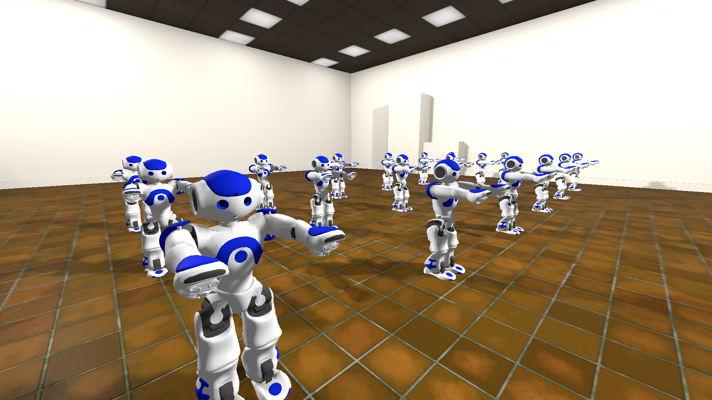
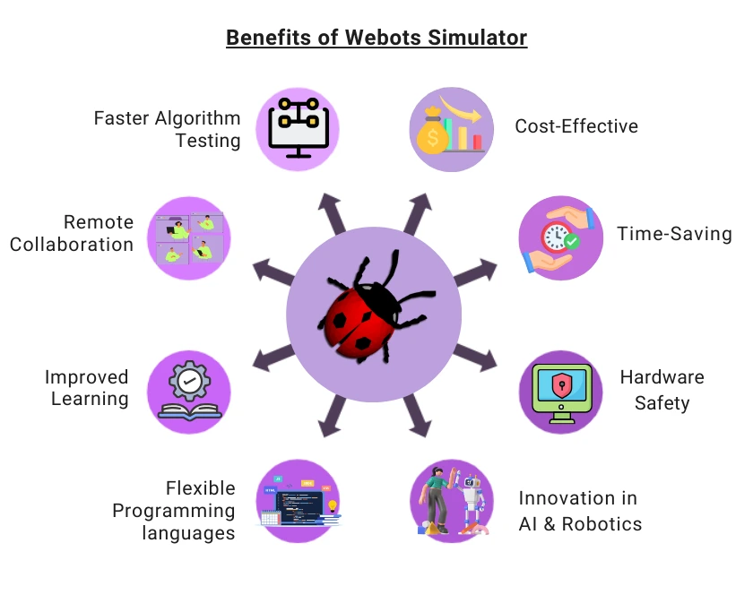
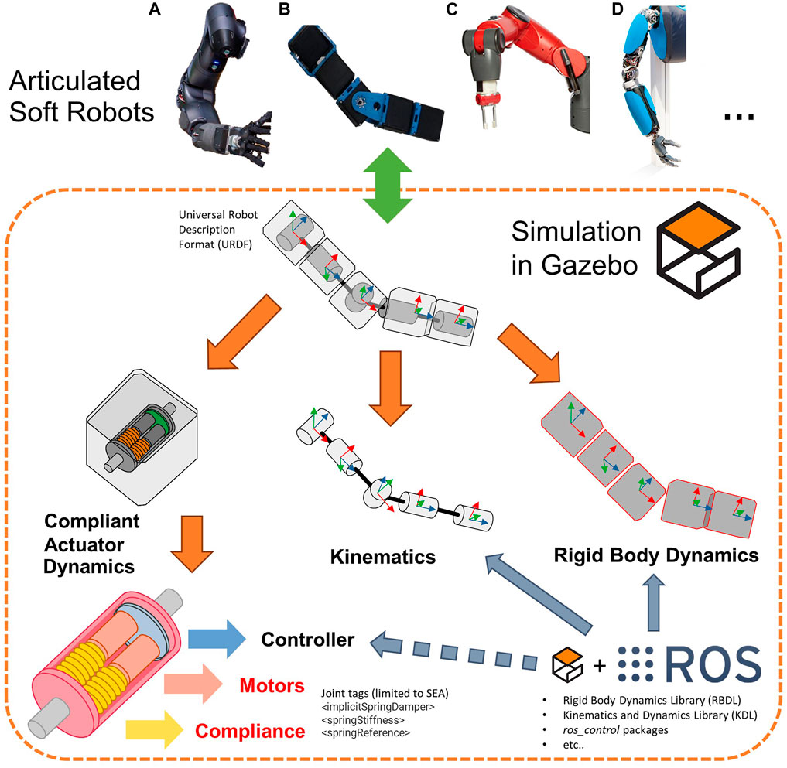
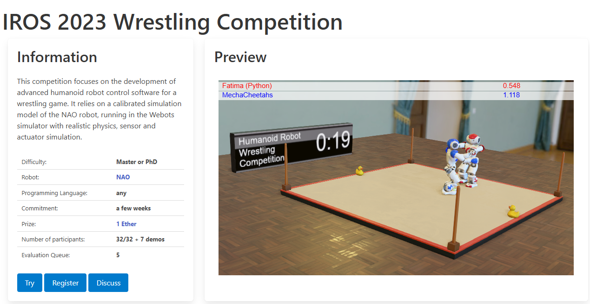

# Simuladores

Simuladores são muito úteis pra flexibilizar o desenvolvimento de software para robôs. Não há dependência de aspectos físicos pra prototipar e testar algoritmos e funcionalidades, além da possibilidade de ter uma plataforma versátil que cada desenvolvedor pode trabalhar de forma independente, sem requisitos de material ou espaço físico.

> :bulb: Simuladores são fundamentais para que seja possível trabalhar com técnicas como **[machine learning](https://en.wikipedia.org/wiki/Machine_learning)**, **[testes automatizados](https://pt.wikipedia.org/wiki/Automação_de_teste)**, etc.

Este material fala sobre os principais simuladores utilizados para pesquisa, desenvolvimento e/ou educação em robótica. São alguns deles:

- [Webots](https://cyberbotics.com)
- [Gazebo/Ignition](https://gazebosim.org/home)
- [CoppeliaSim](https://www.coppeliarobotics.com)
- [NVIDIA IsaacSim](https://developer.nvidia.com/isaac/sim)

## Webots

- APIs simples para escrever controladores fora do ambiente de simulação, C, C++, Python, Java, MATLAB.
- Fácil reaproveitar código no robô real (programas de controle podem rodar externamente).
- Suporta [ROS/ROS2](/ROS/README.md), mas requer configuração extra.
- Em geral, foca em prototipagem rápida e integração simples com código existente.
- Dispõe de um editor visual pra robôs, mas também aceita modelos em VRML, PROTO, CAD, URDF.
  - Você pode montar um robô "caixa" simples e anexar sensores.
- Edição do mundo e do cenário podem ser feitas na interface.
- Usa ODE ou Bullet como _engines_ da simulação de física, simula colisões e atritos com fidelidade razoável.
- Inclui nativamente sensores de cor, distância (ultrassônicos/IR), toque (bumpers) e gisroscópio / IMU.
- Conhecido por interface gráfica amigável e ampla documentação, facilitando pra iniciantes.
- Roda em Windows, Linux e macOS.
- Open source.

## Gazebo / Ingition

- Desenvolvido especificamente para o [ROS](/ROS/README.md).
- API nativa em C++/Python (via ROS).
- Ideal para projetos que já usem ROS, caso contrário é necessário criar as camadas de interface/comunicação, o que pode complicar um pouco.
- Modular e flexível para comunicação via socket ou ROS, bom para sistemas complexos.
- Pra modelagem de robôs usa arquivos URDF, SDF. Adicionar sensores ou mudar a estrutura exige editar esses XMLs.
- Definição do mundo com arquivos SDF.
- _Engines_ de simulação podem ser ODE, Bullet, DART, Simbody, etc.
- Tem plugins para sensores LiDAR (laser), IMU, GPS, câmeras, sensores de contato, etc.
- Mais complexo: exige entendimento de ROS e configurações mais detalhadas. Maior flexibilidade, mas também exige mais tempo pra dominar. Excelente para casos em que há alto custo computacional envolvido. A arquitetura é mais escalável que em outros simuladores.
- Otimizado para Ubuntu/ROS, mas é possível instalar em Windows e macOS.
- Open source.

## CoppeliaSim

- Programação externa via API em Python, C++, MATLAB, scripts internos em Lua.
- Não existe integração com ROS "out-of-the-box", mas a API flexível facilita a adaptação.
- Permite criar robôs na interface ou importar arquivos URDF, OBJ, CAD e tem uma biblioteca de peças.
- Ambiente de criação de cena completo.
- Sensores de distância, câmeras, toque, IMU, etc.
- Meio do caminho em complexidade: tem interface amigável, mas muitos recursos avançados.
- Roda em Windows, Linux e macOS.
- Não é open source, mas gratuito pra educação e pesquisa.
- Em alguns estudos é considerado o simulador mais fiel a robôs reais. Gazebo vem logo atrás.

# Recursos legais

- [Webots Cloud](https://webots.cloud): plataforma web com simulações, animações, protótipos e cenas diversas de robótica. Dá pra programar alguns robôs pelo browser, e o site traz inclusive algumas competições/desafios online (semelhantes ao antigo "robot benchmark", pra quem lembra).

# Referências

- [Webots](https://cyberbotics.com)
- [Wikipedia: Webots](https://en.wikipedia.org/wiki/Webots)
- [Gazebo/Ignition](https://gazebosim.org/home)
- [Wikipedia: Gazebo](<https://en.wikipedia.org/wiki/Gazebo_(simulator)>)
- [CoppeliaSim](https://www.coppeliarobotics.com)
- [NVIDIA IsaacSim](https://developer.nvidia.com/isaac/sim)
- [Wikipedia: Machine Learning](https://en.wikipedia.org/wiki/Machine_learning)
- [Wikipedia: Automação de testes](https://pt.wikipedia.org/wiki/Automação_de_teste)
- [Webots vs. Gazebo: Choosing a Robotics Simulator](https://thinkrobotics.com/blogs/learn/webots-vs-gazebo-choosing-a-robotics-simulator)
- [Compare CoppeliaSim vs. Gazebo vs. NVIDIA Isaac Sim vs. Webots](https://slashdot.org/software/comparison/CoppeliaSim-vs-Gazebo-vs-NVIDIA-Isaac-Sim-vs-Webots)
- [V-REP, Gazebo or ARGoS? A Robot Simulators Comparison](https://lenkaspace.net/tutorials/programming/robotSimulatorsComparison)
- [A Systematic Comparison of Simulation Software for Robotic Arm Manipulation using ROS2](https://arxiv.org/pdf/2204.06433)
- [Why is Gazebo very famous in the ROS community? what about Webots?](https://discourse.openrobotics.org/t/why-is-gazebo-very-famous-in-the-ros-community-what-about-webots/42459)
- [How to pick a mobile robot simulator: A quantitative comparison of CoppeliaSim, Gazebo, MORSE and Webots with a focus on the accuracy of motion simulations](https://www.researchgate.net/publication/361876364_How_to_pick_a_mobile_robot_simulator_A_quantitative_comparison_of_CoppeliaSim_Gazebo_MORSE_and_Webots_with_a_focus_on_the_accuracy_of_motion_simulations)
- [Top 5 Simulation Software for Robotics Development](https://thinkrobotics.com/blogs/learn/top-5-simulation-software-for-robotics-development)
