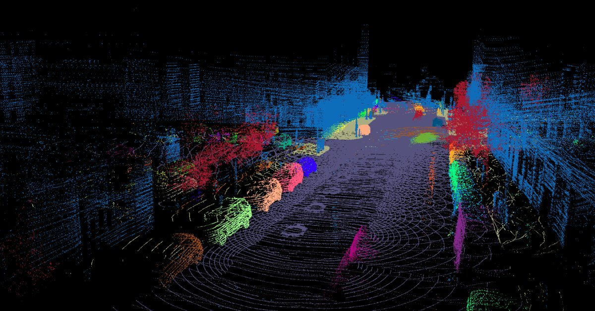
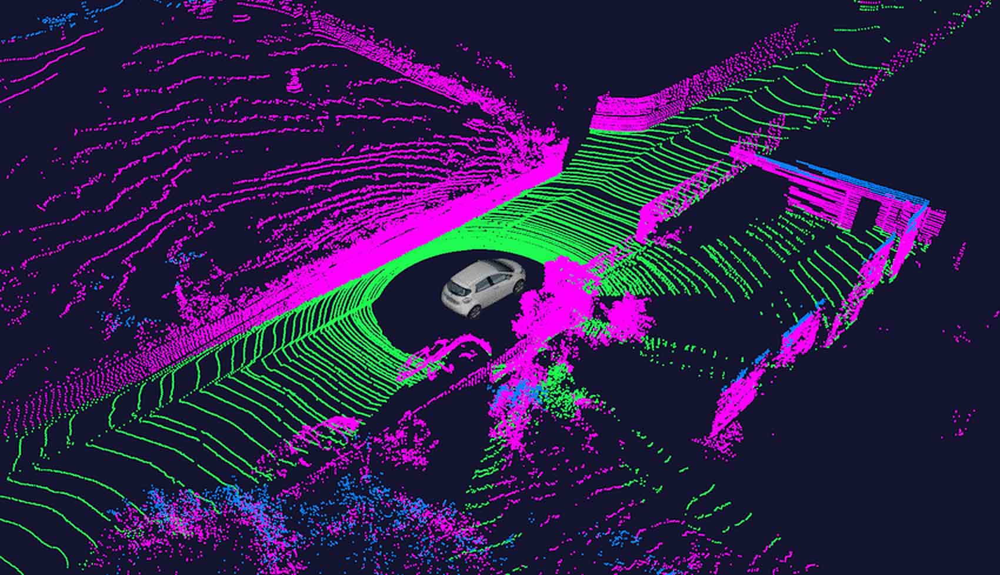

# Point Clouds

Uma nuvem de pontos é um conjunto de vértices em um sistema de coordenadas tridimencional.

Cada ponto pode, além da geometria (X, Y, Z), carregar atributos adicionais:

- Intensidade
- Cor
- Normal
  - Vetor normal à superfície naquele ponto, estimado a partir de pontos vizinhos
- Timestamp

Características:

- Não estruturadas (a ordem dos pontos não importa)
  - Desafio para CNNs tradicionais
- Esparsas (espaços entre os pontos não contém informação)
- Densidade variável
- Ruídos e outliers

Como são geradas?

- LiDAR
- Depth cameras / Time-of-Flight
  - Kinect, sensores de smartphones
  - Similar ao LiDAR, mas para distâncias menores
- Fotogrametria (estimar 3D a partir de múltiplas imagens 2D)
  - Baixo custo
  - Menos precisa e sensível à textura dos objetos e iluminação
- Luz estruturada
  - Projeta padrões de luz e usa a deformação do padrão para inferir profundidade

## Pré-processamento

Filtragem de Outliers

- Exemplo: Statistical Outlier Removal (SOR)

Downsampling

- Redução da densidade
- Viabilizar processamento computacional
- Exemplos: Voxel Grid Downsampling, Farthest Point Sampling (FPS)

Estimativa de normais

- Orientação da superfície

Registro (alinhamento; Registration)

- Combinar múltiplas nuvens de pontos em um único sistema de coordenadas
- Exemplo: Iterative Closest Point (ICP) e suas variantes

## Tarefas comuns

Classificação

- 1 rótulo a 1 nuvem inteira

Segmentação semântica

- Uma classe a cada ponto individualmente

Segmentação de instância

- Um passo além da semântica
- Instâncias individuais de objetos (ex.: carro1, carro2)

Reconstrução de superfícies

- Mesh
- Algoritmos: Poisson Surface Reconstruction, Ball Pivoting

SLAM

## Representações alternativas

- Voxels (cubinhos)
- KD-Tree / Octree
- Meshes

## Deep Learning

Arquiteturas especializadas, porque as CNNs não funcionam diretamente em dados não estruturados.

- PointNet (pioneiro)
  - MLP
  - Pooling simétrico (ex. max pooling)
  - Vetor de características global
  - Invariância à permutação
- PointNet++
  - Captura features locais
  - PointNet recursivamente a sub-nuvens de pontos
  - Hierarquia de features
- Arquiteturas baseadas em Convolução
  - Definição de "convoluções" em nuvens de pontos
- Arquiteturas baseadas em GNNs (Graph Neural Networks)
- Transformers
  - Tokens
  - Mecanismos de atenção

# Bibliotecas

- [PCL](https://pointclouds.org)
- [Pytorch Geometric](https://pytorch-geometric.readthedocs.io/en/latest)
- [Open3D](https://www.open3d.org)
- [ROS](https://www.ros.org) (suporte a nuvem de pontos)

# Datasets

- [ModelNet10/10](https://modelnet.cs.princeton.edu)
- [SemanticKITTI (direção autônoma)](https://semantic-kitti.org)
- [nuScenes (direção autônoma)](https://www.nuscenes.org)

# Fontes

- https://en.m.wikipedia.org/wiki/Point_cloud
- Deep Learning (Goodfellow, Bengio, Courville)
  - Chapter 9: Convolutional Networks
- Artificial Intelligence: A Modern Approach (Russel, Norvig)
  - Chapter 25: Computer Vision
    - 25.6: The 3D World
- Springer Handbook of Robotics
  - Chapter 31: Range sensing
- https://pt.d2l.ai/chapter_computer-vision/index.html
- [Computer Vision: Algorithms and Applications (Richard Szeliski)](https://szeliski.org/Book)
  - Chapter 13: 3D Reconstruction
- https://pointclouds.org
- CS231n: Convolutional Neural Networks for Visual Recognition (Stanford University)
  - https://www.youtube.com/playlist?list=PL3FW7Lu3i5JvHM8ljYj-zLfQRF3EO8sYv
